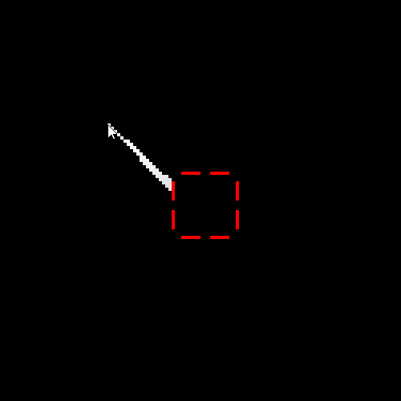

# HxLightMask
A tiny 2D flood-fill lighting engine for Haxe

Ported from [nick-paul/LightMask](https://github.com/nick-paul/LightMask). All credit for this idea and basic algorithm goes to [nick-paul](https://github.com/nick-paul). Also the documentation is based on nick's.



# Running the demo
The demo requires OpenFL 8 to run (older versions will probably work too). The LightMask engine itself is a single Haxe file, has no external dependencies, and is framework agnostic.

```
haxelib install openfl
cd LightMask
cd demo
lime test html5
```

The demo will run on any platform OpenFL supports, including win/mac/linux destkop, HTML5, and Flash.

# How to use

### Initialize LightMask and variables
```Haxe
    // The lightmask itself
    var lightmask:LightMask = new LightMask(WIDTH, HEIGHT);
    // Intensity: Proportional to how far light spreads
    lightmask.setIntensity(40.0);
    // Ambient: Ambient light (0.0 - 1.0)
    lightmask.setAmbient(0.4);

    // Array representing wall opacities (1.0: solid, 0.0: clear)
    // Stored in a single dimensional array
    // To set a wall value at (x,y) use walls[x + WIDTH * y] = ...
    var walls:Array<Float> = [for (i in 0...WIDTH * HEIGHT) {1.0;}];
```

### Adding lights and computing the mask

```Haxe
    // Reset the light mask
    // Must be called every frame
    lightmask.reset();

    // All lights must be added between `reset()` and `computeMask()`
    // Add a light with given brightness at location (x,y)
    // brightness: 0.0 = no light, 1.0 = full light
    lightmask.addLight(x, y, brightness);

    // Compute the mask
    // Pass the `walls` vector to the compute function
    lightmask.computeMask(walls);
```

### Rendering

Assume we are using the following to represent a `Color` object where each channel is a value from `0.0` to `1.0`

```Haxe
    typedef Color {
        var r:Float;
        var g:Float;
        var b:Float;
    }
```

*(In actual practice you would want to use a more efficient data structure, such as an abstract over an `Int`, this is just for example)*

To compute the color of a tile at location `(x,y)` for rendering, multiply the color channels by the light mask at that location

```Haxe
    // Assume the call `map.getTileColor(x,y)`
    // gets the color of the map tile at location (x,y)
    var color:Color = map.getTileColor(x,y);

    // Multiply each of the channels by the light mask
    // 0.0: dark, 1.0: bright
    var tile_brightness:Float = lightmask.mask[x + y * width];
    var lighting_color:Color = {
        r:color.r * tile_brightness,
        g:color.g * tile_brightness,
        b:color.b * tile_brightness
    );

    // Render the tile with the new color
    // Assume `render()` takes an object to render and a color to render it
    // render(object, color)
    render(map.getTile(x, y), lighting_color);
```

# Limitations

  - This was originally developed for a roguelike engine so framerate and performance were not a huge concern. If you have any performance improving ideas, submit an issue or a PR and I'd be happy to take a look.
  - Currently, the blur function creates a black border of unlit tiles on the outer edges of the map. To avoid this, don't use the blur function or make the lightmask slightly larger than the renderer size.
