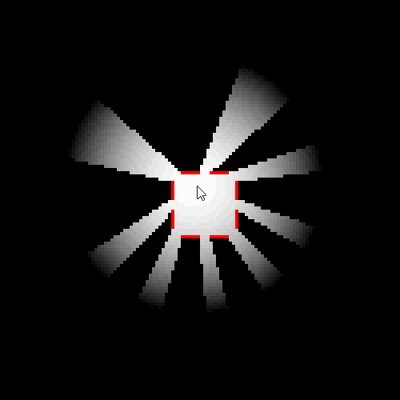
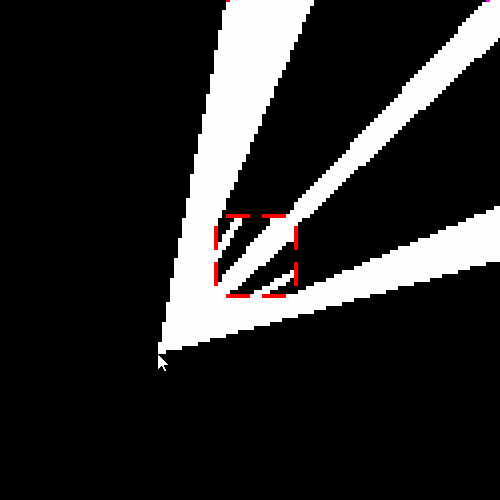
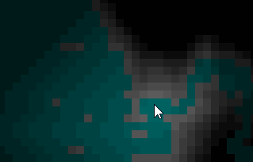

# HxLightMask
A collection of tiny-ish 2D lighting engine tools for Haxe (for grid-based games and whatnot)


Above: the combined result of a `FancyLightMask` paired with a `ShadowMask`

# FancyLightMask

This is a simple ray-casting light mask that lets you put some lights in a scene that will respond properly to walls. All lights are spherical by default,
and their only properties (beside location) is intensity and decay (aka "falloff").



# ShadowMask

This is also a simple ray-casting light mask, but this lets you decide what's NOT visible. 



You can place `Visor`s in the scene that represent visible areas, and you can build a mask of everything that is not visible from any of your specified visors. 
The preview gif at the very top of this page is an example of using a `ShadowMask` and `FancyLightMask` together to create a flashlight effect -- a `Visor` and 
a `Light` are placed in the same location and move together, and the shadow mask is used to occlude everything but the desired light cone.

# FastLightMask

A *very* simple light mask, this doesn't use ray casting and doesn't produce spherical lights. On the plus side, it should be very fast and I don't think the computational cost
grows with the number of lights (unlike the above solutions). Perfectly useful for simpler purposes, or in scenes with cramped quarters.

Originally ported from [nick-paul/LightMask](https://github.com/nick-paul/LightMask). All credit for this idea and basic algorithm goes to [nick-paul](https://github.com/nick-paul). Also the documentation is based on nick's.



# Running the demos
The demo requires OpenFL 8 to run (older versions will probably work too). The FastLightMask engine itself is a single Haxe file, has no external dependencies, and is framework agnostic.

Install libraries:
```
haxelib install openfl
haxelib dev hxlightmask path/to/HxLightMask
```

Build & run demo:
```
cd path/to/HxLightMask
cd demo
lime test html5
```

Press spacebar to advance between demos.

The demos will run on any platform OpenFL supports, including win/mac/linux destkop, HTML5, Flash, etc.

# How to use the tools

## FancyLightMask

### Initialize FancyLightMask and variables
```Haxe
	// The lightmask itself
	var lightmask:FancyLightMask = new FancyLightMask(WIDTH, HEIGHT);
	
	// Array representing walls (1: solid, 0:clear)
	// Stored in a single dimensional array
	// To set a wall value at (x,y) use walls[x * WIDTH * y] =
	var walls:Array<Int> = [for (i in 0...WIDTH * HEIGHT) {0;}];
		
```

### Adding lights and computing the mask

```Haxe
	// Create a light
	var light:Light = new Light(64, 64, 1.0, 0.025); //x, y, intensity, decay
	
	//Add the light (unlike FastLightMask, no need to re-add it after reset())
	lightmask.add(light);
	
	// Reset the light mask
	// Must be called every frame
	lightmask.reset();
	
	// Compute the mask
    // Pass the `walls` vector to the compute function
    lightmask.computeMask(walls);
```

## ShadowMask

### Initialize ShadowMask and variables
```Haxe
	// The shadowmask itself
	var shadowmask:ShadowMask = new ShadowMask(WIDTH, HEIGHT);
	
	// Array representing walls (1: solid, 0:clear)
	// Stored in a single dimensional array
	// To set a wall value at (x,y) use walls[x * WIDTH * y] =
	var walls:Array<Int> = [for (i in 0...WIDTH * HEIGHT) {0;}];
```

### Adding visors and computing the mask

```Haxe
	// Create a visor
	var visor:Visor = visor = new Visor(64, 64, 1.0, 1.0); //x, y, lookVectorX, lookVectorY
	
	//Add the visor
	shadowmask.add(visor);
	
	// Reset the shadow mask
	// Must be called every frame
	shadowmask.reset();
	
	// Compute the mask
    // Pass the `walls` vector to the compute function
    shadowmask.computeMask(walls);
```


## FastLightMask

### Initialize FastLightMask and variables
```Haxe
    // The lightmask itself
    var lightmask:FastLightMask = new FastLightMask(WIDTH, HEIGHT);
    // Intensity: Proportional to how far light spreads
    lightmask.setIntensity(40.0);
    // Ambient: Ambient light (0.0 - 1.0)
    lightmask.setAmbient(0.4);

    // Array representing wall opacities (1.0: solid, 0.0: clear)
    // Stored in a single dimensional array
    // To set a wall value at (x,y) use walls[x + WIDTH * y] = ...
    var walls:Array<Float> = [for (i in 0...WIDTH * HEIGHT) {0.0;}];
```

### Adding lights and computing the mask

```Haxe
    // Reset the light mask
    // Must be called every frame
    lightmask.reset();

    // All lights must be added between `reset()` and `computeMask()`
    // Add a light with given brightness at location (x,y)
    // brightness: 0.0 = no light, 1.0 = full light
    lightmask.addLight(x, y, brightness);

    // Compute the mask
    // Pass the `walls` vector to the compute function
    lightmask.computeMask(walls);
```

### Limitations

  - This was originally developed for a roguelike engine so framerate and performance were not a huge concern. If you have any performance improving ideas, submit an issue or a PR and I'd be happy to take a look.
  - Currently, the blur function creates a black border of unlit tiles on the outer edges of the map. To avoid this, don't use the blur function or make the lightmask slightly larger than the renderer size.

## Rendering the output of any of these

Assume we are using the following to represent a `Color` object where each channel is a value from `0.0` to `1.0`

```Haxe
    typedef Color {
        var r:Float;
        var g:Float;
        var b:Float;
    }
```

*(In actual practice you would want to use a more efficient data structure, such as an abstract over an `Int`, this is just for example)*

To compute the color of a tile at location `(x,y)` for rendering, multiply the color channels by the light mask at that location

```Haxe
    // Assume the call `map.getTileColor(x,y)`
    // gets the color of the map tile at location (x,y)
    var color:Color = map.getTileColor(x,y);

    // Multiply each of the channels by the light mask
    // 0.0: dark, 1.0: bright
    var tile_brightness:Float = lightmask.mask[x + y * width];
    var lighting_color:Color = {
        r:color.r * tile_brightness,
        g:color.g * tile_brightness,
        b:color.b * tile_brightness
    );

    // Render the tile with the new color
    // Assume `render()` takes an object to render and a color to render it
    // render(object, color)
    render(map.getTile(x, y), lighting_color);
```


